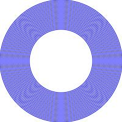

# 画圆的艺术
#### 序：
<pre class="preface">
一日 娃甚无聊 求父同乐而不得 不悦。
遂就之曰：人不可负时，教你剪纸成型，拟万物像，如何？
娃曰： 可得自在否？
父曰： 如镜花水月，图有其象耳。
娃曰： 无聊之极，不学不学。
父曰： 天冷衫薄，就蹦床卯跳如何？
娃曰： 可得自在否？
父曰： 如骏马扶尘，不可无缰也
娃曰： 无聊之至，不去不去。
父曰： 你这顽童，这也不学那也不干，打开你的笔记本跟老爸学编程吧。

</pre>
## 教学目标
	1. 针对6岁左右的孩子，认识基本的英文单词即可。
	2. 如果孩子喜欢画画最好（没见过不喜欢画画的孩子^_^）。
	3. 经本章教学，让孩子掌握基本的函数调用。了解计算机擅长的事情，激发孩子学习编程语言的兴趣。

## 课前准备
### 家长
1. 知识预备：熟悉基本的git命令，掌握基本网页编程环境， 知道出错怎么排查（不在孩子面前丢脸^_^）
2. 下载代码：
   git clone https://github.com/nan-king/p4nan.git
3. 阅读代码： 
   docs/lesson1/nan.html 源代码，每个注释的代码片段可以当着一个小结来教学。
4. 拷贝框架：
   新建 test.html
```js
<script src="../lib/nan-init-v1.js"></script>
<script>
// 画圆
//drawCycle(100,100,100)
</script>
```


### 学童&&家长
1. 和小朋友比试一下，看谁画的圆最圆。预热一下背景。
2. 适当介绍圆的原理： 圆上的任何一点到圆心的距离相等。
3. 然后，再简单讲一下位置标定，x,y坐标（可类比学校座位，几行几列， 显示器也是几行几列，列号是x，行号是y，15寸mac是(2880x1800) )。适可而止，不要让孩子感觉枯燥。

## 小试牛刀--画圆

文本编辑器打开原先准备的：  docs/lesson1/test.html
同事浏览器也打开这个文件（此时，浏览器显示白板）。

让小朋友自己删掉  drawCycle 前面的注释，test.html文件内容变成：
```js
<script src="../lib/nan-init-v1.js"></script>
<script>
// 画圆
drawCycle(100,100,100)
</script>
```
刷新浏览器。最完美的圆登场了，让小朋友对比一下自己画的圆和计算机画的圆吧。
 


## 再接再厉--画好多圆

多画几个圆看看？ 画两个就行了，其他的请大人代劳（不要让单调重复的工作消磨小朋友的兴趣）

```js
// 直接画同心园:
drawCycle(100,100,100)
drawCycle(100,100,98)
drawCycle(100,100,96)
drawCycle(100,100,94)
drawCycle(100,100,92)
drawCycle(100,100,90)
drawCycle(100,100,88)
drawCycle(100,100,86)
drawCycle(100,100,84)
drawCycle(100,100,82)
drawCycle(100,100,80)
drawCycle(100,100,78)
drawCycle(100,100,76)
drawCycle(100,100,74)
drawCycle(100,100,72)
drawCycle(100,100,70)
drawCycle(100,100,68)
drawCycle(100,100,66)
drawCycle(100,100,64)
drawCycle(100,100,62)
drawCycle(100,100,60)
drawCycle(100,100,58)
drawCycle(100,100,56)
drawCycle(100,100,54)
drawCycle(100,100,52)
drawCycle(100,100,50)

```
刷新一下看看？ 一组神奇的同心圆出现了，有点像一张光盘。



## 极限拓展--循环画圆

	结合前面的经验，给孩子强调一下上述工作真枯燥。对齐了问题，再一起想办法解决。
	解决办法呢？ 就是用循环语法，一下子画好多圆。展示一下强大的循环处理，让枯燥的重复工作变得更简单。

	背景知识补充：
	1. 讲解一下变量声明，变量就是一个位置（代号），比如：班长是谁，有可能是子萱，也可能是子涵😄，
	2. 讲一下while 这个单词的意思（当…的时候），

```js
// 条件循环画同心圆1:
var r=100;
while(r>60){
   drawCycle(100,100,r)
   r=r-2
}

```
